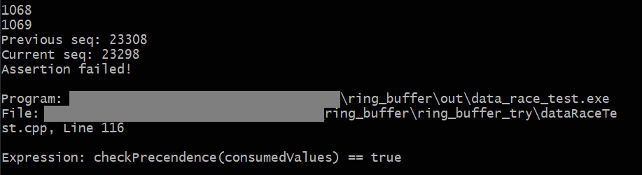

Попытка написать циклический буфер на основе атомарных операций, в котором при добавлении элемента в случае полного буфера перезаписывается самый старый элемент.

Thread Sanitizer выявляет в данной реализации data race, что подтверждается при выполнении теста `dataRaceTest.cpp`:



Проблема в следующем.  
Возможна последовательность выполнения команд, указанная ниже ( 1. - 2. - 3. ):

```c++
// snippet from ring_buffer_atomic_try.hpp
template<typename T>
bool RingBufferAtomicTry<T>::put(const T & value)
{
    size_t head = _head.load(std::memory_order_relaxed);
    size_t nextHead = next(head);

    size_t expectedTail = nextHead;
	
    // 2.
	_tail.compare_exchange_strong(  expectedTail, next(nextHead),
                                    std::memory_order_release,
                                    std::memory_order_relaxed);

    _buffer[head] = value;
    _head.store(nextHead, std::memory_order_release);

    return true;
}

template<typename T>
bool RingBufferAtomicTry<T>::get(T & value)
{
    // 1.
    size_t tail = _tail.load(std::memory_order_relaxed);

    if (tail == _head.load(std::memory_order_acquire))
    {
        return false;
    }

    // 3.
    value = _buffer[tail];
    _tail.store(next(tail), std::memory_order_release);

    return true;
}
```

1) Загрузка _tail из памяти.
2) [пусть буфер полон] Перезапись _tail.
3) Чтение из буфера по индексу, полученному на шаге 1, но этот индекс уже является индексом _head.